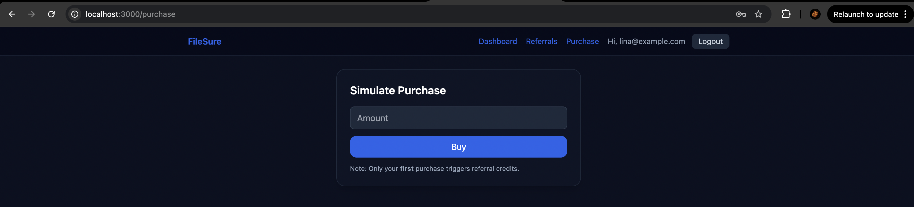

# Referral & Credit System

Build a referral and credit system within a digital product platform (e.g., e-book store, SaaS tool, or
digital goods marketplace). The goal is to demonstrate your ability to design, implement, and deliver
a scalable full-stack application with clean architecture, modern UI, and thoughtful engineering
practices.


### 👍 Tested Endpoint in swagger

- 


### 👍 UI

- 
- 
- 
- 
- 


## Quick Start

    git clone https://github.com/bappasahabapi/Referral-And-Credit-System.git
    


🔥 Run Backend:

```bash

cd backend
npm install
create .env and paste the code from .env.example file which i provided in the root

npm run seed
npm run dev

---
output:

> backend@1.0.0 dev
> tsx src/server.ts

✅ MongoDB connected
🚀 Server listening on port 4000
```

🔥 Run Forntend


```bash
cd fronted
npm install

create .env and paste the code from .env.example file which i provided in the root

npm run dev

---
output:

> frontend@1.0.0 dev
> next dev -p 3000

✔ Console Ninja extension is connected to Next.js, see https://tinyurl.com/2vt8jxzw
  ▲ Next.js 14.2.8
  - Local:        http://localhost:3000
  - Environments: .env

 ✓ Starting...
 ✓ Ready in 1811ms


```

### Technical Requirements

| **Area**             | **Expectation**                                                                                                                                                           |
| -------------------- | ------------------------------------------------------------------------------------------------------------------------------------------------------------------------- |
| **Frontend**         | Built with **Next.js 14**, **TypeScript**, and **Tailwind CSS**. Use **Framer Motion** (or similar) for animations and transitions. |
| **Backend**          | Developed using **Node.js**, **Express**, and **TypeScript**, following **RESTful API** design principles.                                                                |
| **Database**         | **MongoDB** (or equivalent). Design and implement your own schema to model users, referrals, purchases, and credits.                                                      |
| **State Management** | Use **Redux Toolkit**  for predictable and maintainable client state management.                                                                 |
| **Validation**       | Perform both **client-side and server-side validation** using Zod (frontend) and backend schema validation.                                                               |
| **Error Handling**   | Implement **graceful error handling** for invalid inputs, failed API calls, and duplicate actions. Provide user feedback via UI toasts.                                   |
| **Security**         | Store **hashed credentials** (bcrypt). Manage **secure environment variables**. Use **httpOnly cookies** and **JWT** for authentication.                                  |
| **UX/UI**            | Provide a **modern, responsive dashboard** with clear hierarchy and smooth animations.                                                                                    |
| **Code Quality**     | Ensure **type safety**, clean modular code, and consistent formatting (ESLint + Prettier).                                                                                |
| **Performance**      | Use **efficient database queries**, caching where needed, and avoid redundant API calls.                                                                                  |
| **Architecture**     | Follow a **modular, scalable, maintainable architecture** with separation of concerns across models, controllers, and services.                                           |

